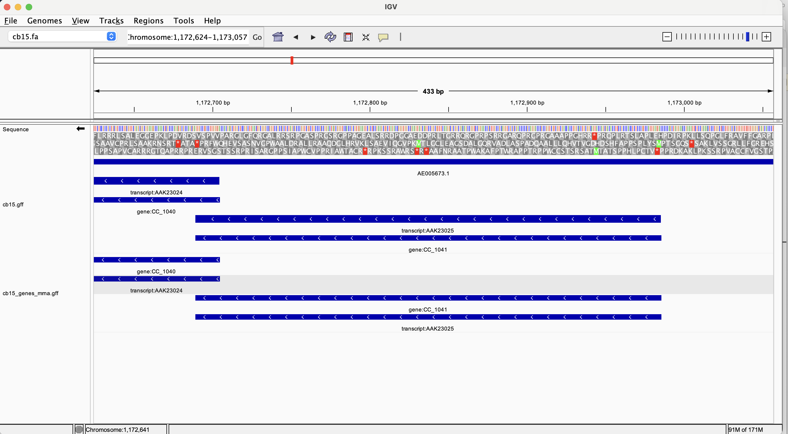

# Week 3 Assignment #

## Download *Caulobacter vibrioides* CB15 genome fasta ##

```bash
#download fasta from Ensembl
wget https://ftp.ensemblgenomes.ebi.ac.uk/pub/bacteria/current/fasta/bacteria_0_collection/caulobacter_vibrioides_cb15_gca_000006905/dna/Caulobacter_vibrioides_cb15_gca_000006905.ASM690v1.dna.toplevel.fa.gz

#unzip file
gunzip Caulobacter_vibrioides_cb15_gca_000006905.ASM690v1.dna.toplevel.fa.gz

#rename file
mv Caulobacter_vibrioides_cb15_gca_000006905.ASM690v1.dna.toplevel.fa cb15.fasta
```
## Download *Caulobacter vibrioides* CB15 genome gff ##


```bash
#download gff from Ensembl
wget https://ftp.ensemblgenomes.ebi.ac.uk/pub/bacteria/current/gff3/bacteria_0_collection/caulobacter_vibrioides_cb15_gca_000006905/Caulobacter_vibrioides_cb15_gca_000006905.ASM690v1.62.gff3.gz

#unzip file
gunzip Caulobacter_vibrioides_cb15_gca_000006905.ASM690v1.62.gff3.gz

#rename file
mv Caulobacter_vibrioides_cb15_gca_000006905.ASM690v1.62.gff3 cb15.gff
```

## Determine genome length ##
```bash
#make a new fasta file without the header line and determine the character count
cat cb15.fa | grep -v '>' > cb15cleaned.fa | wc -c
#Output: 4080000. This is longer than expected

#remove all non-base characters from the fasta and determine the character count
cat cb15cleaned.fa | tr -cd 'ATCG' | wc -c
#Output: 4016947
```
The *C. vibrioides* genome is 4016947 bases long.


## Determine how many features of each type the GFF contains ##
```bash
cat cb15.gff | grep -v '#' | cut -f 3 | sort-uniq-count-rank
```
**output:**
```
3794	exon
3737	CDS
3737	gene
3737	mRNA
57  	ncRNA_gene
51  	tRNA
6   	rRNA
1   	chromosome
```
## Separate the intervals of type "gene" or "transcript" into a different file. ##
As demonstrated above, this annotation does not include any transcripts. Instead, I separated genes and mRNA.

```bash
#subset genes and mRNA and save as a new file
cat cb15.gff | awk '$3=="mRNA" || $3=="gene"' > cb15_genes_mrna.gff
```

## Visualize the original and simplified GFF in IGV ##
Below, I show the gene CC_1041 and its corresponding transcript. In the middle reading frame shown in the transcript table, we see that this gene begins with a start codon and ends with a stop codon.

