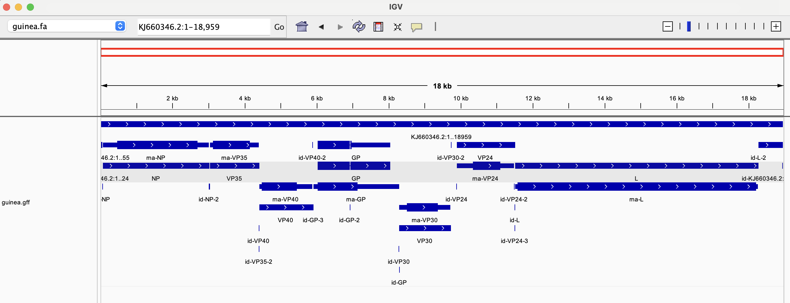

# Week 4 Assignment #
## Group 1 - Ebolavirus 

I downloaded the fasta and gff for KJ660346, the genome of an ebolavirus sample from a patient in Guinea in 2014. In Gire et al, ebolavirus genomes from patients throughout West Africa are compared to this genome to identify mutations and determine how the 2014 ebola outbreak spread.

``` bash
#download fasta
efetch -db nuccore -format fasta -id KJ660346 > guinea.fa

#download gff
efetch -db nuccore -format gff3 -id KJ660346 > guinea.gff
```
### Determine sequence length
``` bash
seqkit stats guinea.fa
```
output:
```
file       format  type  num_seqs  sum_len  min_len  avg_len  max_len
guinea.fa  FASTA   DNA          1   18,959   18,959   18,959   18,959
```

### Count features
``` bash
cat guinea.gff | grep -v '#' | cut -f 3 | sort-uniq-count-rank
```
output:
```
16	region
11	CDS
7	exon
7	gene
7	mRNA
2	long_terminal_repeat
2	primer_binding_site
1	sequence_feature
```

### Investigate gene functions
The longest gene in the genome (determined by visualization in IGV) is called L. It codes for an RNA-dependent RNA polymerase, meaning that it synthesizes RNA using an RNA template (Volchkov et al., 1999).

An additional gene is GP, which encodes ebolavirus glycoprotein. GP is located on the surface of the virion and binds host cell receptors, mediating entry into host cells (Palleson et al., 2017). Due to its importance to infection, GP has been studied extensively and is used in ebola vaccines (Hoenen et al., 2010).

### Visualize genome
This genome is short and compact, with minimal intergenomic space, as shown in the image below. Approximately 75% of the genome is protein-coding.



### Alternative genome builds
There are many ebolavirus genome builds available. OZ222062 is an assembly of Sudan ebolavirus, a strain of ebolavirus that results in much lower human fatality than Zaire ebolavirus, which was responsible for the 2014 West African outbreak. By comparing the genomes sequenced in Gire et al with this assembly, the authors could identify differences that are potentially responsible for this difference in virulence. Since 2014, there have also been additional ebola outbreaks. The genome assembly OR084859 comes from from a patient sampled in the 2020 ebola outbreak in the DRC. This and other more recent samples could be added to the phylogeny presented in Gire et al to determine whether ebolavirus spilled over from nonhuman hosts independently in 2014 and 2020.

## References ##
Gire, Stephen K., Augustine Goba, Kristian G. Andersen, et al. “Genomic Surveillance Elucidates Ebola Virus Origin and Transmission during the 2014 Outbreak.” Science 345, no. 6202 (2014): 1369–72. https://doi.org/10.1126/science.1259657.

Hoenen, Thomas, Allison Groseth, and Heinz Feldmann. “Current Ebola Vaccines.” Expert Opinion on Biological Therapy 12, no. 7 (2012): 859–72. https://doi.org/10.1517/14712598.2012.685152.

Pallesen, Jesper, Charles D. Murin, Natalia de Val, et al. “Structures of Ebola Virus GP and sGP in Complex with Therapeutic Antibodies.” Nature Microbiology 1, no. 9 (2016): 16128. https://doi.org/10.1038/nmicrobiol.2016.128.

Volchkov, Viktor E., Valentina A. Volchkova, Alexandr A. Chepurnov, et al. “Characterization of the L Gene and 5′ Trailer Region of Ebola Virus.” Journal of General Virology 80, no. 2 (1999): 355–62. https://doi.org/10.1099/0022-1317-80-2-355.
