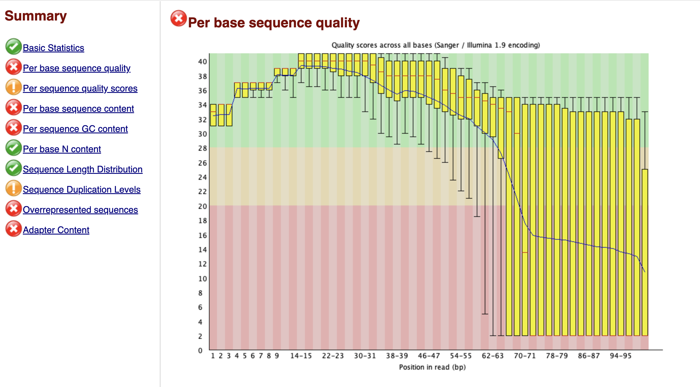
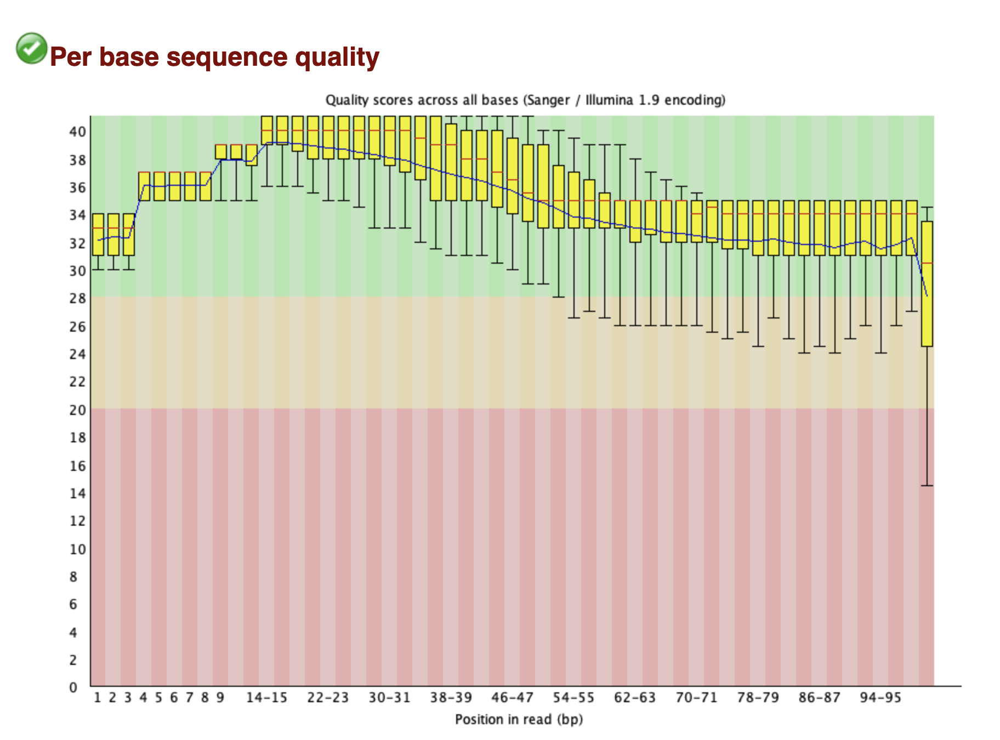
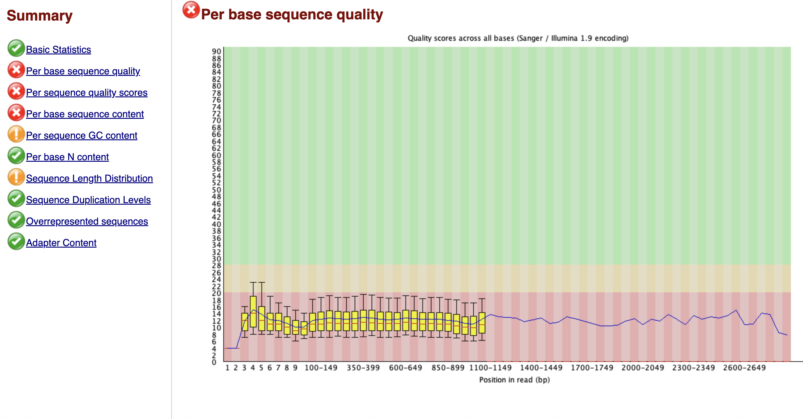

# Week 5 Assignment - Ebolvirus paper #

## Redo week 4 assignment ##

For the week 4 assignment, I examined KJ660346, the genome of an ebolavirus sample from a patient in Guinea in 2014. This work is repeated by the following script, which downloads the fasta and gff files, determines the sequence length, and counts and ranks the features.

``` bash
week4redo.sh
```

### Ouput ###
```
file       format  type  num_seqs  sum_len  min_len  avg_len  max_len
guinea.fa  FASTA   DNA          1   18,959   18,959   18,959   18,959

16	region
11	CDS
7	exon
7	gene
7	mRNA
2	long_terminal_repeat
2	primer_binding_site
1	sequence_feature

```

## Download and analyze sequencing datasets from SRA ##

The following script contains all of the code for the remainder of the assignment: downloading an Illumina sequencing dataset, performing a quality check, and trimming reads, then downloading an Oxford Nanopore sequencing dataset and performing a quality check.

```
srr.sh 
 ```

I chose to download reads from sample G5881.1 (SRR1972953), which was sampled by Gire et al. The sample has 2,974,554 pairs of reads which total 600.9 Mbases. Thus, each pair of reads is about 200 bases long on average. The genome is approximately 19,000 bases long. So, for 10x coverage I downloaded 190,000/200 = 9500 pairs of reads.


### Metadata
```
        "run_accession": "SRR1972953",
        "sample_accession": "SAMN03254258",
        "sample_alias": "G5881.1",
        "sample_description": "Zaire ebolavirus genome sequencing from 2014 outbreak in Sierra Leone",
        "first_public": "2015-06-05",
        "country": "Sierra Leone",
        "scientific_name": "Zaire ebolavirus",
        "fastq_bytes": "234443214;207113917",
        "base_count": "600859908",
        "read_count": "2974554",
        "library_name": "G5881.1.l1",
        "library_strategy": "RNA-Seq",
        "library_source": "TRANSCRIPTOMIC",
        "library_layout": "PAIRED",
        "instrument_platform": "ILLUMINA",
        "instrument_model": "Illumina HiSeq 2500",
        "study_title": "Zaire ebolavirus Genome sequencing",
        "fastq_url": [
            "https://ftp.sra.ebi.ac.uk/vol1/fastq/SRR197/003/SRR1972953/SRR1972953_1.fastq.gz",
            "https://ftp.sra.ebi.ac.uk/vol1/fastq/SRR197/003/SRR1972953/SRR1972953_2.fastq.gz"
        ],
        "info": "234 MB, 207 MB files; 3.0 million reads; 600.9 million sequenced bases"
```

### Read statistics
```
file                      format  type  num_seqs  sum_len  min_len  avg_len  max_len
reads/SRR1972953_1.fastq  FASTQ   DNA      9,500  959,500      101      101      101
reads/SRR1972953_2.fastq  FASTQ   DNA      9,500  959,500      101      101      101

```

### Quality check
The fastqc report indicates that the sequence quality decreases towards the end of the reads. Furthermore, the GC content does not match the expected distribution, likely indicating contamination. Several overrepresented sequences were identified, with the possible sources noted as adapters and RNA PCR primers.




After trimming, the sequence quality looks like this:



# Download a genome using another sequencing method

I downloaded an ebolavirus genome sequenced by Quick et al using Oxford Nanopore technology. This sample is from the 2015 outbreak in Guinea, and these scientists argue that Oxford Nanopore is a promising option for surveiling ebola in Guinea since the equipment required is portable and sequencing can be performed on-site.

I dowloaded 2000 reads and ran sequencing statistics. As demonstrated in the output below, there is much more variation in read length than in the Illumina reads, which were all the same length. The average read length is also much longer than the Illumina reads.

```
file                    format  type  num_seqs    sum_len  min_len  avg_len  max_len
reads/ERR1014225.fastq  FASTQ   DNA      1,000  1,058,726      354  1,058.7    2,877
```

Overall, the sequence quality is  low, as visualized below.




# References

Gire, Stephen K., Augustine Goba, Kristian G. Andersen, et al. “Genomic Surveillance Elucidates Ebola Virus Origin and Transmission during the 2014 Outbreak.” Science 345, no. 6202 (2014): 1369–72. https://doi.org/10.1126/science.1259657.

Quick, J., Loman, N., Duraffour, S. et al. "Real-time, portable genome sequencing for Ebola surveillance". Nature 530, 228–232 (2016). https://doi.org/10.1038/nature16996