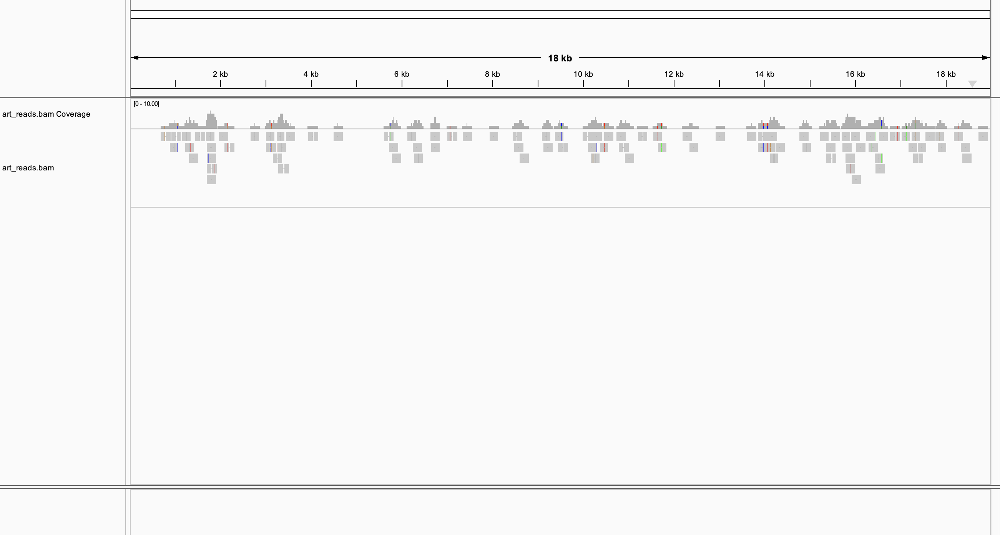
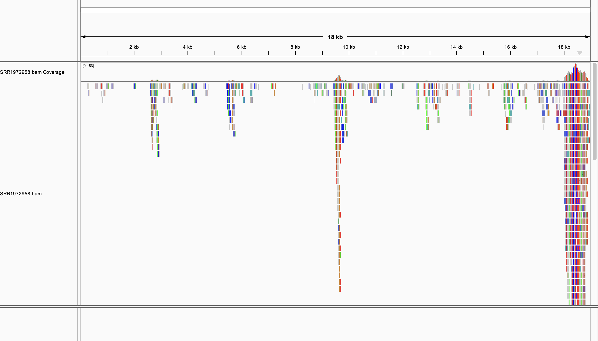

# Assignment 6 - Aligning ebolavirus reads

## Summary
My makefile contains the following code:\
**genome:** downloads and indexes a reference genome from NCBI.\
**simulate:** creates simulated reads using ART\
**reads:** downloads reads from SRA and generates read statistics\
**qc:** trims reads and generates a fastqc report before and after trimming\
**align:** aligns trimmed reads to the reference genome\
**stats:** generates alignment statistics

## Downloading the reference genome

This target downloads and indexes genomes from GenBank using NCBI accession numbers. The default reference genome is AF086833.

```bash
make genome GENOME=AF086833
```

**output**
```
file                   format  type  num_seqs  sum_len  min_len  avg_len  max_len
genome/AF086833.fasta  FASTA   DNA          1   18,959   18,959   18,959   18,959
```

## Creating simulated reads

This target uses the reference genome to create simulated paired reads. By default, enouch 100-base-long reads are generated to reach an average coverage of 1x.

```bash
make simulate GENOME=AF086833
```
**output:**
```
file                             format  type  num_seqs  sum_len  min_len  avg_len  max_len
reads/art_reads_1.trimmed.fastq  FASTQ   DNA         95    9,500      100      100      100
reads/art_reads_2.trimmed.fastq  FASTQ   DNA         95    9,492       92     99.9      100
```


## Quality control
This target generates a fastqc report for the raw reads, trims reads, and then generates a fastqc report for the trimmed reads. If using simulated reads, set READID=art_reads. Note that the quality of simulated reads should be high and trimming should not be required.

```bash
make qc READID=art_reads
```

## Aligning reads
This target aligns the trimmed reads to the reference genome. If using simulated reads, set READID=art_reads.

```bash
make align GENOME=AF086833 READID=art_reads
```

## Generate alignment statistics
```bash
make stats READID=art_reads
```

**output:**
```
samtools flagstat alignments/art_reads.bam
190 + 0 in total (QC-passed reads + QC-failed reads)
190 + 0 primary
0 + 0 secondary
0 + 0 supplementary
0 + 0 duplicates
0 + 0 primary duplicates
190 + 0 mapped (100.00% : N/A)
190 + 0 primary mapped (100.00% : N/A)
190 + 0 paired in sequencing
95 + 0 read1
95 + 0 read2
190 + 0 properly paired (100.00% : N/A)
190 + 0 with itself and mate mapped
0 + 0 singletons (0.00% : N/A)
0 + 0 with mate mapped to a different chr
0 + 0 with mate mapped to a different chr (mapQ>=5)
```

As expected, 100% of the simulated reads mapped properly to the reference genome. When visualized in IGV, the aligned simulated reads appear like this:



## Downloading reads from SRA
The default SRR ID is SRR35257019.

```bash
make reads READID=SRR1972958
```

**output - read statistics:**
```
file                      format  type  num_seqs  sum_len  min_len  avg_len  max_len
reads/SRR1972958_1.fastq  FASTQ   DNA      9,500  959,500      101      101      101
reads/SRR1972958_2.fastq  FASTQ   DNA      9,500  959,500      101      101      101
```

## Quality control
```bash
make qc READID=SRR1972958
```
**output - statistics for trimmed reads:**
```
file                              format  type  num_seqs  sum_len  min_len  avg_len  max_len
reads/SRR1972958_1.trimmed.fastq  FASTQ   DNA      6,847  618,237       15     90.3      101
reads/SRR1972958_2.trimmed.fastq  FASTQ   DNA      6,847  527,338       15       77      101
```

## Align reads to reference genome and generate statistics
This code assumes paired reads and will need to be edited for single-end reads.
```bash
make align stats READID=SRR1972958 GENOME=AF086833
```
**Output**
```
13710 + 0 in total (QC-passed reads + QC-failed reads)
13694 + 0 primary
0 + 0 secondary
16 + 0 supplementary
0 + 0 duplicates
0 + 0 primary duplicates
540 + 0 mapped (3.94% : N/A)
524 + 0 primary mapped (3.83% : N/A)
13694 + 0 paired in sequencing
6847 + 0 read1
6847 + 0 read2
452 + 0 properly paired (3.30% : N/A)
458 + 0 with itself and mate mapped
66 + 0 singletons (0.48% : N/A)
0 + 0 with mate mapped to a different chr
0 + 0 with mate mapped to a different chr (mapQ>=5)
```
Only 3.94% of reads mapped to the genome. The expected coverage was 10x, but after trimming, the average read length was 83.65. 540 reads were mapped to the reference genome, which is 18959 bases long, so 540 * 83.65/18959 = 2.38x coverage. 

The coverage is very inconsistent across the genome, ranging from 0 to 83x. The end of the genome has the greatest coverage, as visualized below.


