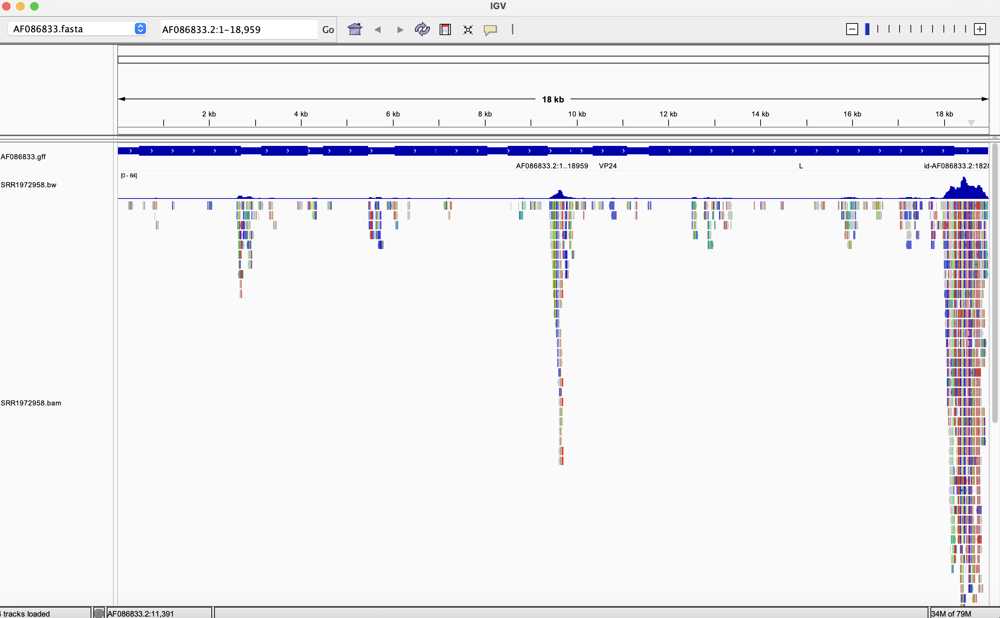
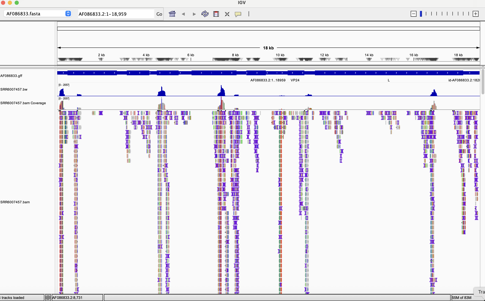

# Week 7 Assignment - Ebolavirus BAM

## Summary
My makefile contains the following code:\
**help** explains usage\
**genome:** downloads and indexes a reference genome from NCBI and downloads the gff file\
**simulate:** creates simulated reads using ART\
**reads:** downloads reads from SRA and generates read statistics\
**qc:** trims reads and generates a fastqc report before and after trimming\
**align:** aligns trimmed reads to the reference genome\
**stats:** generates simple alignment statistics and generates a wiggle file
**all** runs genome, reads, qc, align, and stats

# Generating an alignment from Illumina reads
I first ran the code to create a bam file and wiggle file for SRR1972958, which is an Illumina run with paired-end reads.

## Downloading the reference genome

This target downloads and indexes genomes from GenBank using NCBI accession numbers. The default reference genome is AF086833.
```bash
make genome GENOME=AF086833
```

**output**
```
file                   format  type  num_seqs  sum_len  min_len  avg_len  max_len
genome/AF086833.fasta  FASTA   DNA          1   18,959   18,959   18,959   18,959
```
## Downloading reads from SRA
The default SRR ID is SRR35257019. The default assumes that reads are paired. If using single-end reads, use PAIRED=false.

```bash
make reads READID=SRR1972958 PAIRED=true
```

**output - read statistics:**
```
file                      format  type  num_seqs  sum_len  min_len  avg_len  max_len
reads/SRR1972958_1.fastq  FASTQ   DNA      9,500  959,500      101      101      101
reads/SRR1972958_2.fastq  FASTQ   DNA      9,500  959,500      101      101      101
```

## Quality control
This target generates a fastqc report for the raw reads, trims reads, and then generates a fastqc report for the trimmed reads.

```bash
make qc READID=SRR1972958 PAIRED=true
```
**output - statistics for trimmed reads:**
```
file                              format  type  num_seqs  sum_len  min_len  avg_len  max_len
reads/SRR1972958_1.trimmed.fastq  FASTQ   DNA      6,847  618,237       15     90.3      101
reads/SRR1972958_2.trimmed.fastq  FASTQ   DNA      6,847  527,338       15       77      101
```

## Align reads to the reference genome
```bash
make align READID=SRR1972958 GENOME=AF086833 PAIRED=true
```

## Generate alignment statistics
This target prints simple alignment statistics and generates a wiggle file.
```bash
make stats READID=SRR1972958 GENOME=AF086833 PAIRED=true
```
**Output**
```
13710 + 0 in total (QC-passed reads + QC-failed reads)
13694 + 0 primary
0 + 0 secondary
16 + 0 supplementary
0 + 0 duplicates
0 + 0 primary duplicates
540 + 0 mapped (3.94% : N/A)
524 + 0 primary mapped (3.83% : N/A)
13694 + 0 paired in sequencing
6847 + 0 read1
6847 + 0 read2
452 + 0 properly paired (3.30% : N/A)
458 + 0 with itself and mate mapped
66 + 0 singletons (0.48% : N/A)
0 + 0 with mate mapped to a different chr
0 + 0 with mate mapped to a different chr (mapQ>=5)
```

The screenshot below shows the annotation, alignment and wiggle file visualized in IGV.



# Generating an alignment from ion torrent reads
I used SRR6007457, reads generated using ion torrent sequencing on a sample from a patient in Sierra Leone. I used the all target to run all needed code in a single step.
```bash
make all GENOME=AF086833 READID=SRR6007457 PAIRED=false
```
**read statistics:**
```
file                      format  type  num_seqs    sum_len  min_len  avg_len  max_len
reads/SRR6007457_1.fastq  FASTQ   DNA      9,500  1,409,845        8    148.4      241
```
**alignment statistics**
```
9258 + 0 in total (QC-passed reads + QC-failed reads)
9215 + 0 primary
0 + 0 secondary
43 + 0 supplementary
0 + 0 duplicates
0 + 0 primary duplicates
8617 + 0 mapped (93.08% : N/A)
8574 + 0 primary mapped (93.04% : N/A)
0 + 0 paired in sequencing
0 + 0 read1
0 + 0 read2
0 + 0 properly paired (N/A : N/A)
0 + 0 with itself and mate mapped
0 + 0 singletons (N/A : N/A)
0 + 0 with mate mapped to a different chr
0 + 0 with mate mapped to a different chr (mapQ>=5)
```
The screenshot below shows the annotation, alignment and wiggle file visualized in IGV.




### Briefly describe the differences between the alignment in both files.
Both alignments have highly variable coverage across the genome. However, SRR6007457 (the ion torrent run) has more regions with high coverage, while reads from SRR35257019 are very concentrated at the end of the genome. The maximum coverage is also over 30 times deeper for SRR6007457.

### Briefly compare the statistics for the two BAM files.
A much greater percentage of the reads from the ion torrent run aligned to the reference genome. About 93% of these reads aligned, compared to only 4% of the Illumina reads. 13694 reads from SRR35257019 were paired, while no reads from SRR6007457 were paired, as these were single-end reads.

### How many primary alignments does each of your BAM files contain?
The BAM file for the Illumina reads contains 540 primary alignments. The BAM file for the ion torrent reads contains 8574.

### What coordinate has the largest observed coverage?
I used the following code to answer this question:
```bash
samtools depth alignments/SRR6007457.bam | sort -nk 3 | tail -20
```

Output:
```
AF086833.2	7377	2003
AF086833.2	7376	2009
AF086833.2	7358	2039
AF086833.2	7375	2040
AF086833.2	7364	2052
AF086833.2	7374	2054
AF086833.2	7368	2056
AF086833.2	7359	2057
AF086833.2	7360	2057
AF086833.2	7361	2057
AF086833.2	7362	2057
AF086833.2	7363	2057
AF086833.2	7365	2057
AF086833.2	7366	2057
AF086833.2	7367	2057
AF086833.2	7369	2057
AF086833.2	7370	2057
AF086833.2	7371	2057
AF086833.2	7372	2057
AF086833.2	7373	2057
```

So, the largest coverage occurs from 7359-7373.

### Select a gene of interest. How many alignments on the forward strand cover the gene?
I chose the gene GP, which is a glycoprotein. 
```bash
#Determine coordinates of gene
awk '$3=="gene"' genome/AF086833.gff | grep "GP"
```
**Output:**
```
AF086833.2	Genbank	gene	5900	8305	.	+	.	ID=gene-GP;Name=GP;gbkey=Gene;gene=GP;gene_biotype=protein_coding
```
This gene spans from 5900-8305.

```bash
# Extract alignments this region
samtools view -b alignments/SRR6007457.bam AF086833.2:5900-8305 > alignments/gp.bam

# Index the extracted BAM file
samtools index alignments/gp.bam

#generate stats
samtools flagstat alignments/gp.bam
```
**Output:**
```
2499 + 0 in total (QC-passed reads + QC-failed reads)
2492 + 0 primary
0 + 0 secondary
7 + 0 supplementary
0 + 0 duplicates
0 + 0 primary duplicates
2499 + 0 mapped (100.00% : N/A)
2492 + 0 primary mapped (100.00% : N/A)
0 + 0 paired in sequencing
0 + 0 read1
0 + 0 read2
0 + 0 properly paired (N/A : N/A)
0 + 0 with itself and mate mapped
0 + 0 singletons (N/A : N/A)
0 + 0 with mate mapped to a different chr
0 + 0 with mate mapped to a different chr (mapQ>=5)
```
2499 reads mapped to this gene.