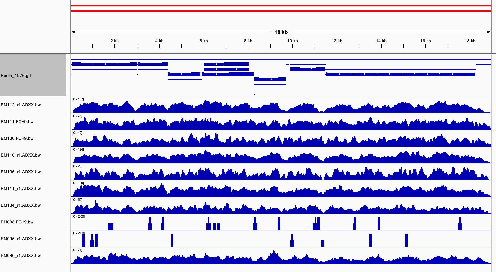

# Week 8 - Automated alignment pipeline (ebolavirus)

## Makefile summary
My makefile contains the following code:\
**help:** explains usage\
**genome:** downloads and indexes a reference genome from NCBI and downloads the gff file\
**reads:** downloads reads from SRA and generates read statistics\
**qc:** trims reads and generates a fastqc report both before and after trimming\
**align:** aligns trimmed reads to the reference genome\
**stats:** generates simple alignment statistics and generates a wiggle file\
**all:** runs genome, reads, qc, align, and stats

## Design file summary
The design file contains the following columns:
- **srr**: the SRA run ID for each sample
- **sampleid**: an identification number for each library prep, assigned by authors of Gire et al


I obtained SRR and sample IDs by downloading RunInfo from SRA as a CSV for all runs in the bioproject PRJNA257197. 

Since some samples were sequenced multiple times, I used library prep IDs rather than original sample IDs to avoid duplicate file names. Each library prep ID begins with the original sample ID. (ex. EM096_r1.ADXX and EM096.FCH9 are two different runs from EM096)

## Code to run pipeline

The pipeline can be run in parallel using the following code:
```bash
cat design.csv |\
parallel -j 6 --colsep , --header : \
make all SRR={srr} SAMPLEID={sampleid} \
GENOME=AF086833 PAIRED=true NREADS=10000
```
This results in the following output:
- **genome**:
  - indexed reference genome file (.fasta, .fai, .bwt, .pac, .ann, .amb)
  - gff file for the reference genome
- **reads**:
  - fastq files for each sample both before and after trimming
- **reports**:
  - fastqc reports for each sample both before and after trimming
  - alignment statistics for all samples in a single text file
- **alignments**:
  - sorted and indexed bam file for each sample
  - wiggle file for each sample for visualization

## Interesting notes from aligning reads from 20 samples
- Alignment rates differ dramatically between samples, ranging from 0% to >90%.
- Regions between genes tend to have lower coverage than genic regions. As visualized below, most samples have dips in coverage around 3kb, 4.5kb, and 11kb, corresponding to the small intergenic regions.

