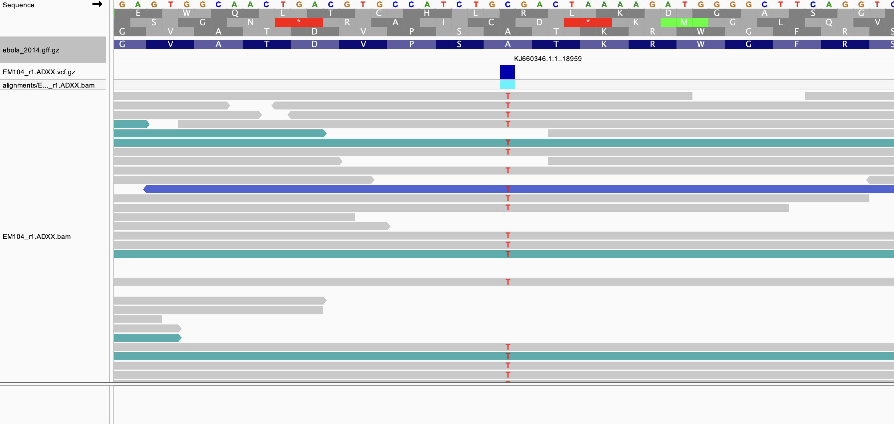
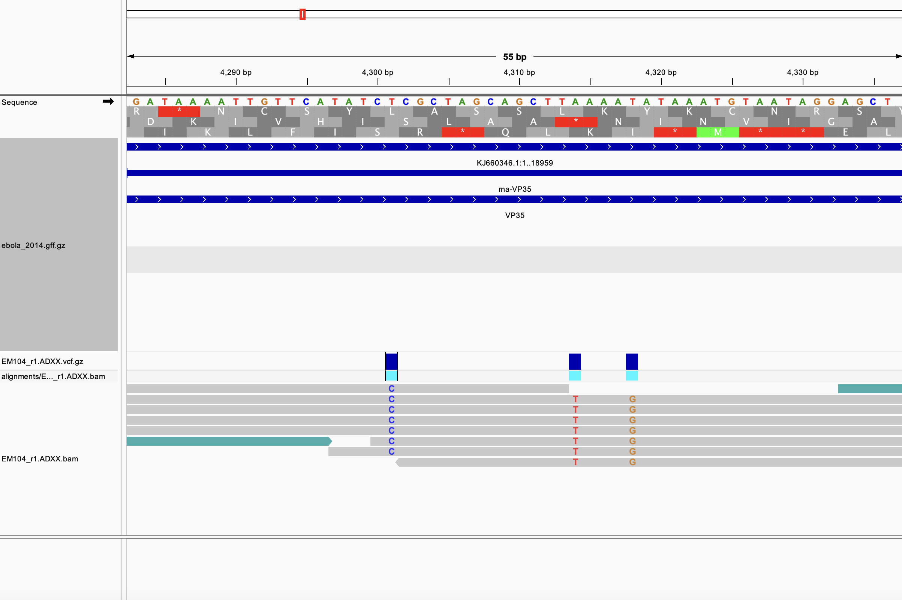
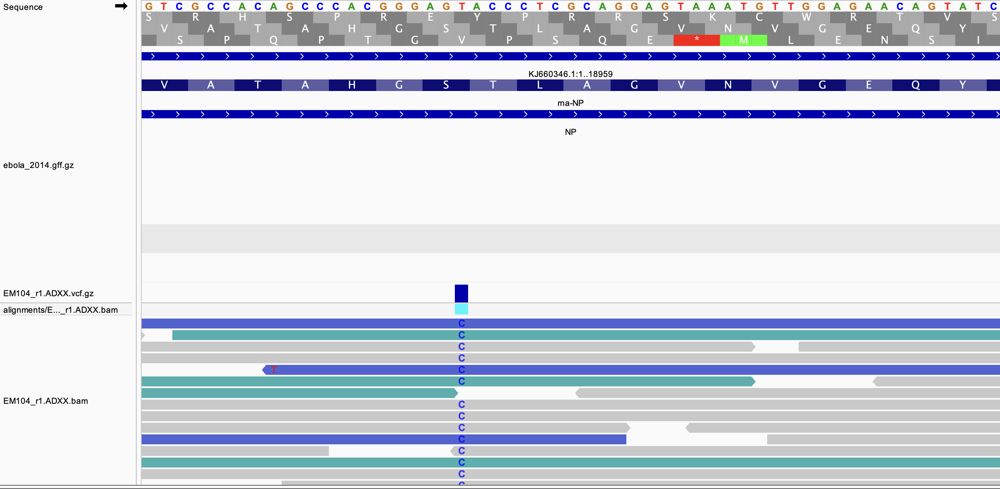

# Week 11 - Variant effect prediction

## Makefile summary
My makefile contains the following code:\
**help:** explains usage\
**genome:** downloads and indexes a reference genome from NCBI and downloads the gff file\
**reads:** downloads reads from SRA and generates read statistics\
**qc:** trims reads and generates a fastqc report both before and after trimming\
**align:** aligns trimmed reads to the reference genome\
**stats:** generates simple alignment statistics and generates a wiggle file\
**variants:** calls variants using bcftools
**merge:** merges vcf files from all samples into a single vcf file\
**vep:** annotates variants using ENSEMBL's VEP tool\


## Design file summary
The design file contains the following columns:
- **srr**: the SRA run ID for each sample
- **sampleid**: an identification number for each library prep, assigned by authors of Gire et al
- **paired**: whether the reads are paired-end (true) or single-end (false)

## Variant effect prediction
When trying to download the snpEff database, I repeatedly got an "error while connecting" message that I wasn't able to resolve. Instead, I used ENSEMBL's VEP tool in the command line.

## Installing Ensembl VEP
My makefile requires that Ensembl VEP be installed in a separate environment. The default location is ~/ensembl. This installation was completed using the following code:
```bash
# Create a new conda environment for VEP
micromamba create -y -n vep \
    perl perl-dbi perl-lwp-simple \
    perl-dbd-mysql perl-bio-db-hts \
    perl-list-moreutils 

# Activate the environment
micromamba activate vep

# Make a directory for ensembl
mkdir -p ensembl
cd ensembl

# Clone the VEP repository
git clone https://github.com/Ensembl/ensembl-vep

# Install the VEP package
perl INSTALL.pl --NO_HTSLIB --NO_TEST
```

## Code to run pipeline

Download and index the reference genome
```bash
make genome GENOME=KJ660346.1 GEN_NAME=ebola_2014
```

To run the pipeline for a single sample, the following code can be used:
```bash
make reads qc align stats variants vep SRR=SRR1553422 SAMPLEID=EM104.FCH9 GENOME=KJ660346.1 GEN_NAME=Ebola_2014  PAIRED=true NREADS=10000
```

The reads can be downloaded, trimmed, aligned, and variants called and annotated in parallel using the following code:
```bash
cat design.csv |\
parallel -j 6 --eta --lb --colsep , --header : \
make reads qc align stats variants vep SRR={srr} SAMPLEID={sampleid} \
GENOME=KJ660346.1 GEN_NAME=ebola_2014 PAIRED={paired} NREADS=10000
```

This results in the following output:
- **genome**:
  - indexed reference genome
  - gff file for the reference genome
- **reads**:
  - fastq files for each sample both before and after trimming
- **reports**:
  - fastqc reports for each sample both before and after trimming
  - alignment statistics for all samples in a single text file
- **alignments**:
  - sorted and indexed bam file for each sample
  - wiggle file for each sample for visualization

- **variants**:
  - vcf file for each sample containing called variants
  - merged vcf file containing  variants from all samples

- **ann**:
  - text and html file for each sample containing variant annotations

## Variant effect examples
The following are all variants in EM104_r1.ADXX

### Non-synonymous SNV in glycoprotein gene
This variant results in a change from alanine to valine.



### 3' UTR variants in VP35



### Synonymous T/C SNV in nucleoprotein gene


