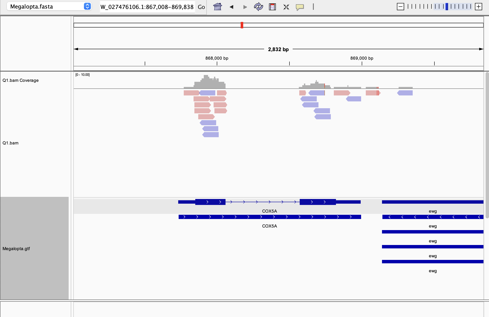
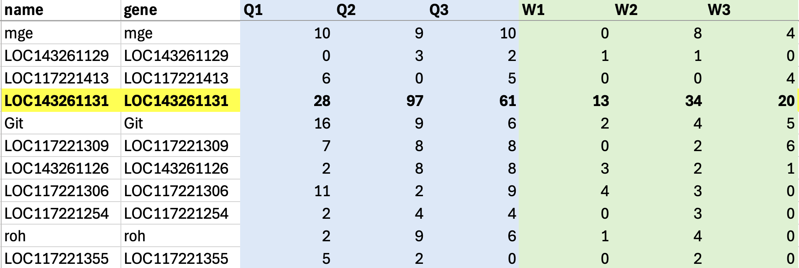

# Week 13 - Count matrix

I analyzed an RNAseq dataset from *Megalopta genalis*, a species of sweat bee that is facultatively eusocial. This dataset compares the brain transcriptomes of queens and workers (Jones et al., 2017). The genome of *M genalis* is not fully assembled, so I aligned reads to a single scaffold that contains a gene that is relevant to my research.


(Look how cute these guys are!)

## Makefile summary
My makefile contains the following code:\
**help:** explains usage\
**genome:** downloads and indexes a reference genome from NCBI and downloads the gff file\
**reads:** downloads reads from SRA and generates read statistics\
**qc:** trims reads and generates a fastqc report both before and after trimming\
**align:** aligns trimmed reads to the reference genome\
**stats:** generates simple alignment statistics and generates a wiggle file

## Design file summary
The design file contains the following columns:
- **srr**: the SRA run ID for each sample
- **sampleid**: an identification number for each bee
- **treatment**: whether the sample is from a queen or a worker

## Code to run pipeline

Download and index the reference genome
```bash
make genome GENOME=NW_027476106.1 GEN_NAME=Megalopta
```

To run the pipeline for a single sample, the following code can be used:
```bash
make reads qc align stats SRR=SRR3948582 SAMPLEID=queen1 \
GENOME=NW_027476106.1 PAIRED=true NREADS=10000
```

The reads can be downloaded, trimmed, and aligned in parallel using the following code:
```bash
cat design.csv |\
parallel -j 6 --eta --lb --colsep , --header : \
make reads qc align stats SRR={srr} SAMPLEID={sampleid} \
GENOME=NW_027476106.1 PAIRED=true NREADS=100000
```
This results in the following output:
- **genome**:
  - indexed reference genome
  - gff file for the reference genome
- **reads**:
  - fastq files for each sample both before and after trimming
- **reports**:
  - fastqc reports for each sample both before and after trimming
  - alignment statistics for all samples in a single text file
- **alignments**:
  - sorted and indexed bam file for each sample
  - wiggle file for each sample for visualization


## Alignment example ##


This screenshot shows the alignment of reads from sample Q1 to the gene COX5A, an enzyme involved in the electron transport chain. Reads align to the exons on each end of the gene and not to the intron in the middle, confirming that this is RNAseq data. We also see that the reads are not strand specific.

## Generating count matrix
To generate a count matrix for all samples, the following code can be used:
```bash
featureCounts -a genome/Megalopta.gtf -p -o counts.txt \
alignments/Q1.bam \
alignments/Q2.bam \
alignments/Q3.bam \
alignments/W1.bam \
alignments/W2.bam \
alignments/W3.bam
```


## Clean count matrix

Filter the count matrix to include only rows for the scaffold NW_027476106.1:

```bash
( head -n 3 counts.txt; grep "NW_027476106.1" counts.txt ) > filtered_counts.txt
```

Convert count matrix to csv:
```bash
Rscript src/r/format_featurecounts.r -c filtered_counts.txt -o counts.csv
```

No genes on this scaffold are dramatically differentially expressed between queens and workers, but the expression of LOC143261131 is approximately doubled on average in queens relative to workers.

