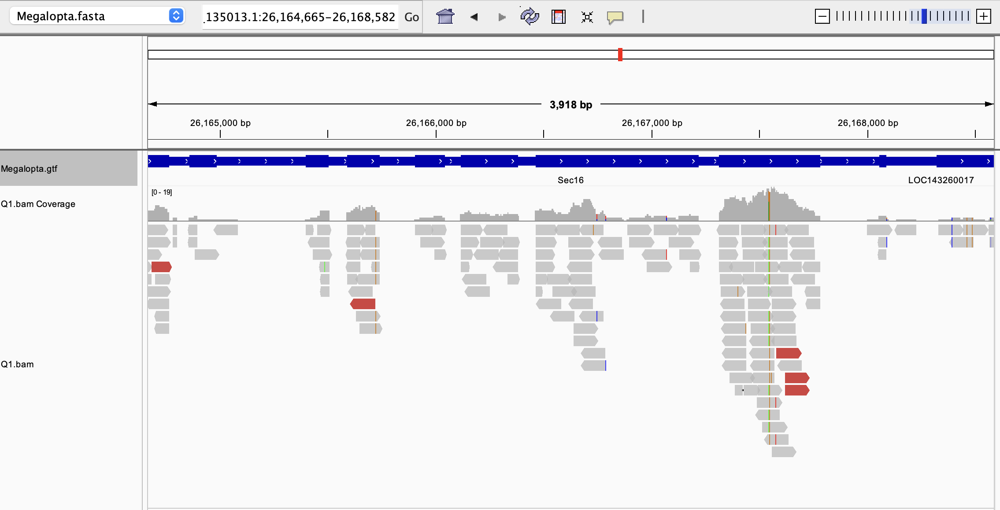
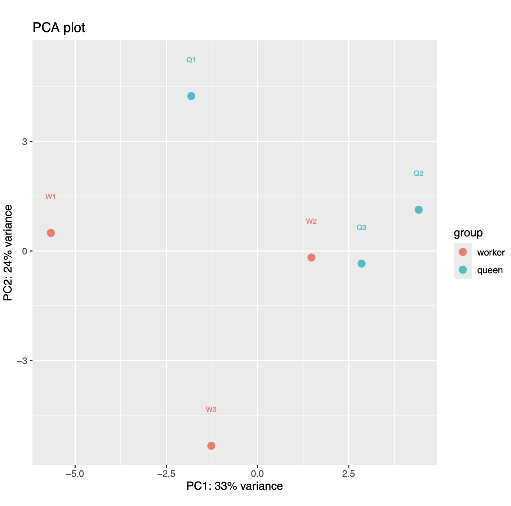
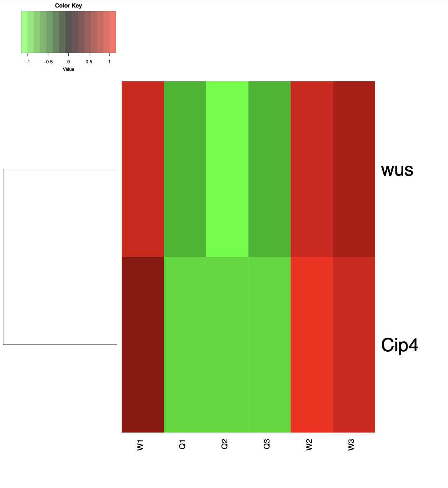

# Week 13 - Count matrix

I analyzed an RNAseq dataset from *Megalopta genalis*, a species of sweat bee that is facultatively eusocial. This dataset compares the brain transcriptomes of queens and workers (Jones et al., 2017).


(Look how cute these guys are!)

## Makefile summary
My makefile contains the following code:\
**help:** explains usage\
**genome:** downloads and indexes a reference genome from NCBI and downloads the gff file\
**reads:** downloads reads from SRA and generates read statistics\
**qc:** trims reads and generates a fastqc report both before and after trimming\
**align:** aligns trimmed reads to the reference genome\
**stats:** generates simple alignment statistics and generates a wiggle file

## Design file summary
The design file contains the following columns:
- **srr**: the SRA run ID for each sample
- **sampleid**: an identification number for each bee
- **treatment**: whether the sample is from a queen or a worker

## Code to run pipeline

Download and index the reference genome. Here I am using chromosome 1.
```bash
make genome GENOME=NC_135013.1 GEN_NAME=Megalopta
```

To run the pipeline for a single sample, the following code can be used:
```bash
make reads qc align stats SRR=SRR3948582 SAMPLEID=queen1 \
GENOME=NC_135013.1 PAIRED=true NREADS=10000
```

The reads can be downloaded, trimmed, and aligned in parallel using the following code:
```bash
cat design.csv |\
parallel -j 6 --eta --lb --colsep , --header : \
make align stats SRR={srr} SAMPLEID={sample} \
GENOME=NC_135013.1 PAIRED=true NREADS=100000
```
This results in the following output:
- **genome**:
  - indexed reference genome
  - gff file for the reference genome
- **reads**:
  - fastq files for each sample both before and after trimming
- **reports**:
  - fastqc reports for each sample both before and after trimming
  - alignment statistics for all samples in a single text file
- **alignments**:
  - sorted and indexed bam file for each sample
  - wiggle file for each sample for visualization


## Alignment example ##


This screenshot shows the alignment of reads from sample Q1 to the gene Sec16, a protein involved in transport from the endosplasmic reticulum. Reads align to the exons but not to the introns, confirming that this is RNAseq data. We also see that the reads are not strand specific.

## Generating count matrix
To generate a count matrix for all samples, the following code can be used:
```bash
featureCounts -a genome/Megalopta.gtf -p -o counts.txt \
alignments/Q1.bam \
alignments/Q2.bam \
alignments/Q3.bam \
alignments/W1.bam \
alignments/W2.bam \
alignments/W3.bam
```

## Clean count matrix

Filter the count matrix to include only rows for the scaffold NW_027476106.1:

```bash
( head -n 3 counts.txt; grep "NC_135013.1" counts.txt ) > filtered_counts.txt
```

Convert count matrix to csv and clean header names:
```bash
Rscript src/r/format_featurecounts.r -c filtered_counts.txt -o counts.csv
sed -i '' '1s/.*/name,gene,Q1,Q2,Q3,W1,W2,W3/' counts.csv
```

## Differential expression analysis with edgeR
```bash
Rscript src/r/edger.r -d design.csv -c counts.csv
```

The analysis finds only two differentially expressed genes at FDR < 0.05: Cip4 and wus.

## Visualize data

Make PCA plot:
```bash
src/r/plot_pca.r -c edger.csv -d design.csv -o pca.pdf
```


The samples do not cluster by caste, suggesting that there are not strong transcriptomic differences between queens and workers in this dataset. This is unsurprising given that only two genes were found to be differentially expressed.


Make heatmap:
```bash
src/r/plot_heatmap.r -c edger.csv -d design.csv -o heatmap.pdf
```



## Functional analysis

It is not possible to perform functional enrichment analysis on just two genes. However, I identified human orthologs for both Cip4 and wus and visualized their functions in genescape. Cip4 is orthologous to formin-binding protein 1 (FNBP1), which is involved in cytoskeleton formation. Wus is orthologous to the heat shock protein DNAJC22. Analysis in genescape indicates that these genes share very few GO terms; they are both protein binding, but otherwise have distinct functions.

The following code can be used to perform enrichment analysis using enrichr for datasets with more differentially expressed genes:
```bash
bio enrichr -c edger.csv 
```

For this dataset, the output includes only headers, as there were no significantly enriched terms.